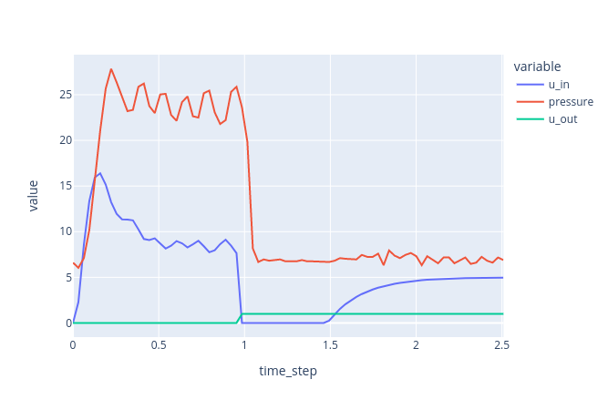

# About

This is my code for the [Ventilator Pressure Prediction Challenge](https://www.kaggle.com/c/ventilator-pressure-prediction/discussion/273855) by Google Brain hosted on kaggle. The goal is to estimate the pressure signal `u_out(t)` based on the incoming signal `u_in(t)` and two time-constant parameters `R` and `C`.



While I didn't have time for any serious submission, I used this challenge to become familiar with:
- developing inside a docker container (see experience below)
- `vscode` IDE
- [pytorch lightning](https://www.pytorchlightning.ai/)

I only evaluated two baseline and one extremly simple model on ~10% of the training data:

| model | MSE on validation set |
| --- | --- |
| zero baseline | 192 |
| linear model | 59 |
| 1D UNet | 8 |

# Developing inside a docker container

## Motivation

Quite a few people seem to be happy developing medium-sized pipelines with an online jupyter notebook hosted by e.g. kaggle or google. However, personally, I find myself to work much quicker and more structured when developing with a local IDE for anything but exploratory data analysis.

However, when starting a new project locally, setting up a new virtual environment with relevant python packages often takes up a significant amount of time (at least with my internet connection...). And when switching to another work station, you might need to install everything again and wait again, keep libraries in sync, etc...

This problem bothered me significantly recently and I hoped that pre-built docker images were the solution. Spoiler: So far, I am very happy with the setup.

## Pull docker image

Download kaggle image using from https://github.com/Kaggle/docker-python . Alternatively, you can pick one of these images with far fewer python packages:

- https://hub.docker.com/r/jupyter/datascience-notebook/
- https://hub.docker.com/r/civisanalytics/datascience-python
- https://github.com/floydhub/dl-docker

## Use docker image in pycharm

Pycharm *professional* allows you to run and debug your python applications directly inside your docker, [see instructions](https://www.jetbrains.com/help/pycharm/using-docker-as-a-remote-interpreter.html).

This worked for me, but had one huge downside (using pycharm professional 2020.2): The indexing of all libraries takes hours. And it automatically runs whenever you open Pycharm again (not just the first time). Without a complete index, you cannot use autocompletion, inspection, etc.

This issue has been raised a couple of times in pycharm forum, mainly in [this thread](https://intellij-support.jetbrains.com/hc/en-us/community/posts/360003478399-Why-it-s-updating-indices-again-and-again-making-it-unusable-at-all). Some comments indicate that it has been fixed in 2021.2.2, but I couldn't test it. Also, the kaggle docker is an extreme example coming at a size of approximately 30 GB.

## Use docker image in vscode

Due to the index issue, I switched to `vscode` including the extension [Remote-Containers](https://code.visualstudio.com/docs/remote/containers). It offers several options to use a docker container:
- attach folder to running container
- open folder in (new) container
- specifiy a docker image, Dockerfile or Docker compose file in a `.devcontainer.json`

In the following, the first option of attaching the folder to a running container will be used. I tried the other options, but had difficulties to establish GPU access for tensorflow and/or pytorch.

## Creating a container with GPU access

Make sure to first install the [NVIDIA Container Toolkit](https://docs.nvidia.com/datacenter/cloud-native/container-toolkit/install-guide.html). Moreover, you need to install NVIDIA drivers on your host. CUDA is already installed in the image.

```bash
# pull the docker image
IMAGE_NAME="gcr.io/kaggle-gpu-images/python"
docker pull $IMAGE_NAME:latest

# create a container from the image
# -t = allocate pseudo terminal
# -d = detached mode, run in background
# -v = mount volume
# --gpus all = allow access to all GPUs
CONTAINER_NAME="my_container"
LOCAL_DIR="/path/to/code/directory"
REMOTE_DIR="/path/to/code/directory"

docker run -t -d -v $LOCAL_DIR:$REMOTE_DIR --workdir=$REMOTE_DIR --name $CONTAINER_NAME --entrypoint=bash --gpus all $IMAGE_NAME

# execute bash command in container
docker exec -it $CONTAINER_NAME bash

# from inside the container: check nvidia-smi
nvidia-smi

# from inside the container: check tensorflow GPU access
python -c "import tensorflow as tf; lst=tf.config.list_physical_devices(); print(lst)"
```

If all commands worked, use the vscode command `Remote-Containers: Attach to a running container` and select the container you just created. A new window will open, where you'll have the same experience as always.